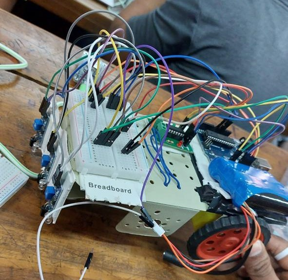

# 2D Labyrinth-Solver Bot

## Description

This Arduino sketch controls a car using infrared (IR) sensors to navigate through a predefined path. The car can move forward, turn left, turn right, perform U-turns, and stop based on the input from the IR sensors.

- This code treats the maze as a graph and employs Depth_First Search Algorithm.
- The bot first covers the leftmost track, then if it encounters any deadend, it reverses and covers centre and right track, sequentially.

## Hardware Used

- IR sensors (3x)
- DC motors (2x)
- L298N motor driver
- Arduino board (e.g., Arduino Uno)
- Breadboard
- Jumper wires

## Wiring

The wiring setup is as follows:

- IR sensor pins connected to digital pins 3, 4, and 5 on the Arduino board
- Motor driver pins connected to digital pins 8, 9, 10, and 11 on the Arduino board

## Code

The code for the bot is written in Arduino IDE using Arduino C. You can find the code in the `code` folder in this repository.

## Setup

1. Connect the hardware components as per the wiring diagram.
2. Upload the provided Arduino sketch (`code.ino`) to your Arduino board using the Arduino IDE.
3. Power up the system and ensure all connections are secure.

## How It Works

The code utilizes the readings from the IR sensors to determine the car's orientation on the path. Based on these readings, the car performs the following actions:

- **Straight path:** Moves forward when the middle IR sensor detects the path ahead.
- **Left turn:** Turns left when the left IR sensor detects a left turn.
- **Right turn:** Turns right when the right IR sensor detects a right turn.
- **T Intersection:** Turns left at a T intersection when the left and right IR sensors detect the path.
- **Dead End:** Performs a U-turn when all IR sensors detect no path ahead.
- **End of Maze:** Stops when all IR sensors detect a path on all sides.

## Usage

1. Ensure the IR sensors are correctly positioned to detect the path.
2. Power up the car and place it on the predefined path.
3. The car will navigate through the path autonomously based on the IR sensor readings.

## Note

- Adjust the sensitivity of IR sensors if necessary to ensure accurate readings.
- Fine-tune the motor driver and motor connections for desired movement.

## Troubleshooting

- If the car deviates from the path, check the positioning and alignment of IR sensors.
- Ensure all connections are secure and correctly wired according to the wiring diagram.

For further assistance or questions, feel free to contact.

